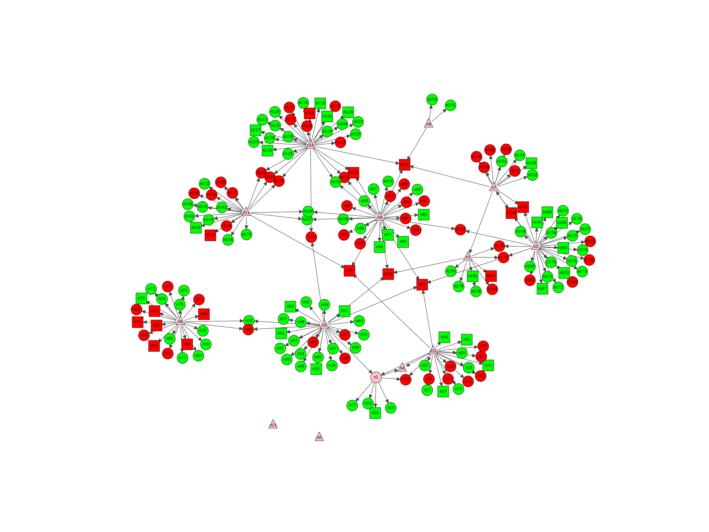

# **Analysis of visual cortical neurons of mice**

<a href="mailto:cristian.bargiacchi@edu.unifi.it">Cristian Bargiacchi</a>
<a href="mailto:christian.mancini1@edu.unifi.it">Christian Mancini</a>
  
https://github.com/cMancio00/sand-2024

---

# Dati

* Il grafo rappresenta la struttura del primo strato della corteccia visiva prefontale di un topo.
* Vengono stimolati dei neuroni (piramidali) e si controlla se, dopo la sinapsi con un altro neurone, quest'ultimo tende a promuovere o inibire l'attività neuronale.

---

# Sinapsi

---

# Domande

* Quali sono i neuroni che promuovere/inibire maggiormente l'attività?
* Quali piramidali sono coinvolti?
* Che proporzione di promotori/inibitori mi aspetto in una sinapsi?
* Altro da discutere :brain: :rocket:

---

# Simple Random Graph Model

Iniziamo a modellare il nostro grafo tramite un **Simple Random Graph** che, anche se semplice, è una buona base di paragone per altri modelli. (Peggio di così non si può fare :smile:).

Da questo primo modello, simuliamo le misure di centralità per vedere se il modello è adeguato e cosa rappresentano.

:bulb: Il vero valore della statistica è contrassegnato in rosso in ogni simulazione.

---

# SRG Betweenes Centrality
  
  Devo mettere le immagini per bene

---

# SRG Densitá

da rivedere le immagini